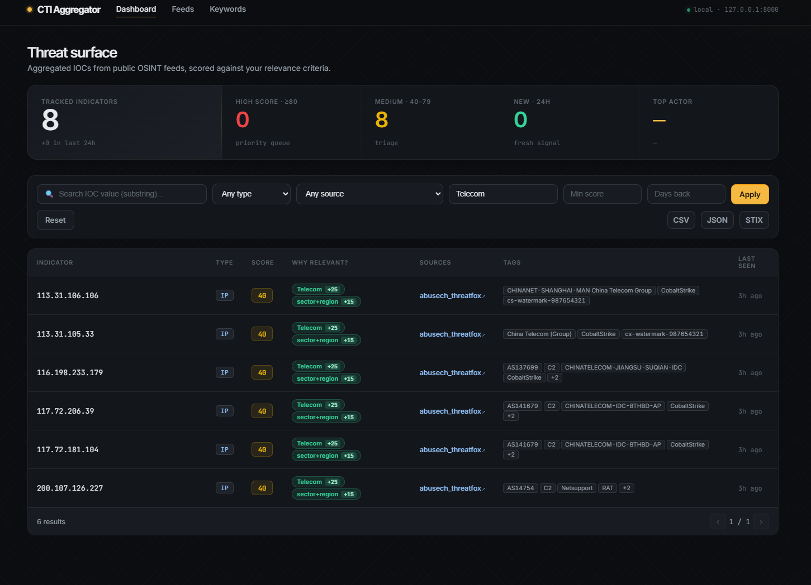
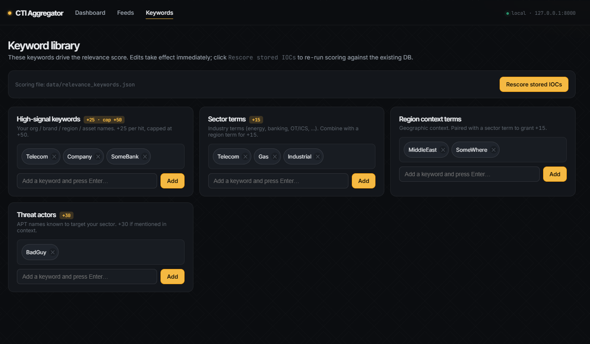
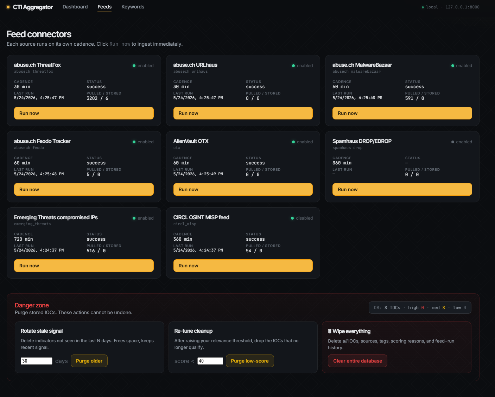
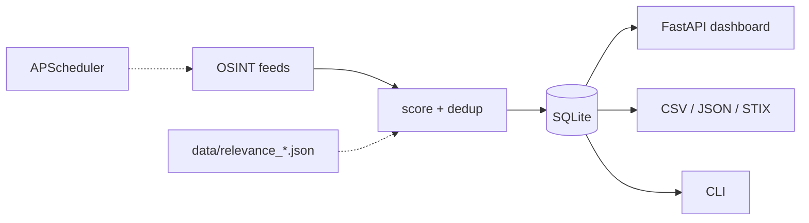

# Smart CTI

A small CTI aggregator that pulls IOCs from public OSINT feeds, scores them against keywords/ASNs/countries you care about, and serves the results from a local web dashboard.

[](https://github.com/AlasmariAhmed/Smart-CTI/actions/workflows/ci.yml)
[](https://www.python.org/)
[](LICENSE)

> Defensive tool only — see [SECURITY.md](SECURITY.md). No scanning, no exploitation, no enumeration.

## Run it

With Docker:

```bash
git clone https://github.com/AlasmariAhmed/Smart-CTI.git
cd Smart-CTI
docker compose up --build
```

Or locally:

```bash
python -m venv .venv
source .venv/bin/activate          # Windows: .venv\Scripts\activate
pip install -r requirements.txt
uvicorn app.main:app --port 8000
```

Open http://127.0.0.1:8000.

The relevance lists ship empty, so IOCs from live feeds will all score 0 until you add your own keywords on the `/keywords` page. To see the dashboard with sample data right away:

```bash
python cli.py seed-demo
```
## Screenshots

**Dashboard** — View and filter scored IOCs.



**Keywords configuration** — Add your organization's relevance terms live.



**Feed management** — Run connectors on demand.



## Sources

- abuse.ch — ThreatFox, URLhaus, MalwareBazaar, Feodo Tracker
- AlienVault OTX (needs a free API key in `.env`)
- Spamhaus DROP / EDROP
- Emerging Threats compromised-IPs
- CIRCL public MISP feed

Each runs on its own schedule (see `config.yaml`). You can also trigger a feed by hand from the Feeds page or the CLI.

## Scoring

Each IOC gets a 0–100 score, additive across these rules:

| signal | points |
|---|---:|
| keyword hit (per keyword, capped at +50 total) | +25 |
| sector term + region context combo | +15 |
| domain / URL host on your `relevance_countries` ccTLDs | +30 |
| IP geolocates to a country on your list | +20 |
| IP ASN on your `relevance_asns` allow-list | +25 |
| threat actor in your `threat_actors` list mentioned in context | +30 |

IOCs below the threshold (default 40) are skipped instead of stored, so the DB stays focused. Every score contribution is written to a `scoring_reasons` table so you can see why something scored what it did.

The lists are JSON files in `data/`:
- `relevance_keywords.json` — org name, brands, sector terms, APTs
- `relevance_asns.json` — your ISP/cloud/partner ASNs
- `relevance_countries.json` — ISO-2 country codes

Edit them through the Keywords page (live, no restart) and click **Rescore stored IOCs** after.

## Architecture



Stack: Python 3.11, FastAPI, SQLAlchemy, APScheduler, SQLite, vanilla JS + custom CSS, pytest, Docker.

## CLI

```bash
python cli.py list-feeds
python cli.py run-feed abusech_threatfox
python cli.py run-all
python cli.py search example.com
python cli.py export --format stix --out iocs.stix.json
python cli.py stats
```

## GeoIP (optional)

For the IP→country rule, drop `GeoLite2-Country.mmdb` from [MaxMind](https://www.maxmind.com/en/geolite2/signup) (free signup) into `data/`. Without it that rule is just skipped.

## Tests

```bash
pytest
```

28 tests, run in under a second. They cover the scoring rules (keyword cap, ccTLD, GeoIP/ASN mocks, threat actors, edge cases) and the connector parsing (mocked HTTP via [respx](https://github.com/lundberg/respx)).


Register it in `app/connectors/__init__.py` and add an entry under `connectors:` in `config.yaml`.

For HTML scrapers, there's a shared helper at `app/connectors/_html_extract.py` that handles IP / domain / URL / hash / CVE extraction with refanging.

## Roadmap

- Toggle connectors on/off from the UI (currently config.yaml + restart)
- Single-password auth before this goes anywhere beyond localhost
- LLM pass for advisory summarization, IOC extraction from unstructured text, and daily exec summaries (pluggable: OpenAI / Anthropic / Ollama)
- More sources: VirusTotal, GreyNoise Community, AbuseIPDB, Shodan, Censys, Pulsedive, additional MISP communities

## License

MIT — see [LICENSE](LICENSE).
